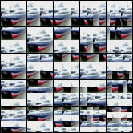

# CNN Spatial Sensitivity

This is an unofficial pytorch implementation of Patch Suffling experiment  conducted in [Interpreting Adversarially Trained Convolutional Neural Networks [Zhang+, ICML2019]](https://arxiv.org/abs/1905.09797) and Masking experiment performed in [Approximating CNNs with Bag-of-local-Features models works surprisingly well on ImageNet [Brendel+, ICLR2019]](https://arxiv.org/abs/1904.00760)

These experiments allow to investigate the spatial sensitivity of CNN representation.

## Requirements

You will need the following to run the codes:
- Python 3.7+
- PyTorch 1.4+
- TorchVision
- numpy
- click
- tqdm
- matplotlib
- seaborn

Note that I run the code with Ubuntu 18, Pytorch 1.4.0, CUDA 10.1.

## Usage

### Patch Suffling

The class `PatchShuffle` in `spatial_sensitivity/patch_shuffle.py` applies Patch Shuffling to input tensor. One can call `PatchShuffle()` same as functions in `torchvision.transforms`.

Following sample code save some Patch Shuffled tensor as image under `logs/patch_shuffle.png`.

```
cd spatial_sensitivity
python patch_shuffle.py
```

The saved image should be like follows.



### Masking

coming soon

## References

- [Tianyuan Zhang, Zhanxing Zhu. "Interpreting Adversarially Trained Convolutional Neural Networks.", in ICML, 2019.](https://arxiv.org/abs/1905.09797)
- [Wieland Brendel, Matthias Bethge. "Approximating CNNs with Bag-of-local-Features models works surprisingly well on ImageNet.", in ICLR, 2019.](https://arxiv.org/abs/1904.00760)